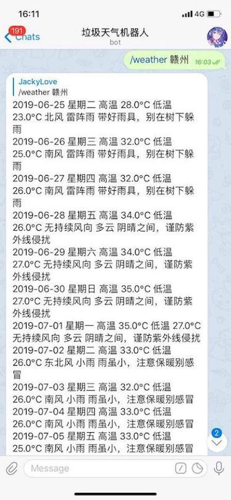
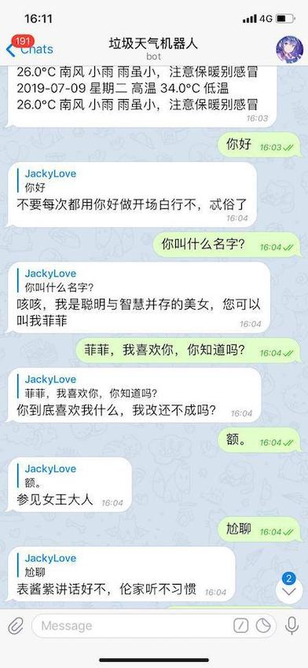

# asynTgbot
## 一个使用封装了telegram机器人API的异步库[AIOGram](https://github.com/aiogram/aiogram)写的简单机器人

### 实现的功能
1. 查询全国各地天气预报
2. 智能聊天
3. 翻译英文
4. 查歌词
5. 讲笑话
6. 数学计算
7. ip或手机归属地查询等。

### 用法
查询天气：/weather 上海
聊天：你好
翻译：翻译 i love you
歌词：歌词青花瓷
笑话：笑话
数学计算：2*3+5
域名：baidu.com
ip: 127.0.0.1

### 效果图

### todo
查询快递？
语音聊天？
再说吧。
